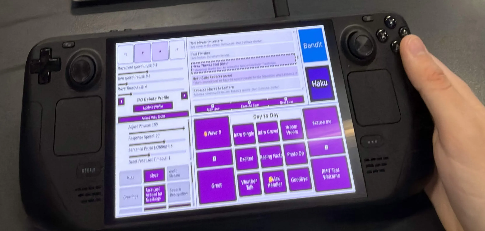

# Robot Web Controller

A browser-based operator console and integration server for Pepper robots and any other robot with a client (there is another ROS Noetic port for a PAL TiaGo). The controller combines manual speech and motion controls, reusable scripts and profiles, robot status monitoring, and streaming AI conversation in one React interface backed by Node.js and Express.



## Capabilities

- Select a robot and interaction profile, run announcements and predefined scripts, or send custom speech.
- Trigger behaviours, control movement/head position, and inspect robot awareness and speaking state.
- Persist selected controls and profile state in the browser.
- Connect to remote streaming STT and Ollama or an optional Bedrock gateway.
- Buffer generated speech by sentence and behaviour markup, track conversation sessions, and coordinate turn-taking.
- Show conversation content and media on the robot tablet, and monitor/reload its webview.
- Inspect service connectivity, detailed robot status, and recent robot messages through APIs.

## Architecture

| Area | Responsibility |
| --- | --- |
| [index.js](index.js) | Express routes, browser WebSockets, robot TCP listener, settings, and conversation integration |
| [frontend/](frontend/) | React operator UI, built by Vite into root `dist/` |
| [utils/robot-api.js](utils/robot-api.js) | Robot identity, connections, status, chunk buffering, and conversation state |
| [utils/ollama-client.js](utils/ollama-client.js) | Native Ollama `/api/generate` streaming client |
| [utils/nova-client.js](utils/nova-client.js) | Optional Amazon Nova Sonic integration |
| [settings/](settings/) | Profiles, scripts, shortcuts, triggers, status mappings, and movement configuration |
| [public/](public/) | Tablet pages, media, and static resources |

Browser clients use HTTP and WebSocket on port `3000`. Robot handlers use a separate **plain TCP** listener on port `3456`; they do not connect to a browser WebSocket route. STT is an external WebSocket service, usually on `8765`. Robot RTP audio goes directly to the STT host, not to Express.

## Requirements

- Node.js 22 LTS, pnpm, and a browser.
- A reachable Pepper handler for robot execution; the UI/backend can run without a robot, but queued commands are not evidence of successful execution.
- Optional AI conversation services: Haku STT and Ollama, or the configured AWS gateway/provider.
- For Nova Sonic: configured AWS credentials, model access, and a supported deployment region.

There are two dependency manifests and lockfiles. Install the root backend and `frontend` dependencies separately. `npm` is also needed by the existing build scripts even when pnpm installs the packages.

## Clone, configure, and run

```bash
git clone --branch feat/local-llm https://github.com/S3942721/robo-web-controller.git
cd robo-web-controller
cp example.env .env
pnpm install
pnpm --dir frontend install
```

Edit `.env` for your service addresses. A local Ollama/STT deployment on the same host uses:

```dotenv
SERVER_HOST=0.0.0.0
SERVER_PORT=3000
SOCKET_PORT=3456
LLM_PROVIDER=ollama
OLLAMA_HOST=127.0.0.1
OLLAMA_PORT=11434
OLLAMA_MODEL=Haku
OLLAMA_TIMEOUT=120000
STT_SERVER_HOST=127.0.0.1
STT_SERVER_PORT=8765
STT_LLM_ENABLED=true
ROBOT_IDENTIFICATION_METHOD=socket
DEFAULT_ROBOT_NAME=Haku
```

Use reachable hostnames/IPs without URL schemes for `OLLAMA_HOST` and `STT_SERVER_HOST`. Set `OLLAMA_MODEL` to the name listed by Ollama; Haku's helper scripts default to `Haku`, while `example.env` defaults to `haku`. `LLM_PROVIDER` defaults to `bedrock` in code, so set it explicitly for local inference.

Disable `enabled` in [settings/nova-sonic-config.json](settings/nova-sonic-config.json) when using only the local pipeline. Nova Sonic is a separate optional speech integration, not a requirement for Ollama.

```bash
pnpm run build-start
```

Open `http://localhost:3000` on the host or `http://CONTROLLER_IP:3000` from a network device. Select the robot and profile, then inspect robot/service status before sending commands. Configure Pepper's handler to connect to `CONTROLLER_IP:3456` and, for remote STT audio, to the STT machine's UDP port `5004`.

For manual operation, leave STT/LLM services stopped and use the speech/behaviour/script controls. Missing-service logs are expected in that arrangement. `STT_DISABLED=true` (or `STT_SERVER_HOST=disabled`) changes the advertised network configuration; it does not suppress every STT connection/health-check worker.

## Development commands

| Working directory | Command | Effect |
| --- | --- | --- |
| Repository root | `pnpm start` | Start Express and the robot TCP listener |
| Repository root | `pnpm dev` | Restart the backend with nodemon |
| Repository root | `pnpm run build` | Build the frontend into `dist/` |
| Repository root | `pnpm run build-start` | Build the frontend, then start the backend |
| `frontend/` | `pnpm dev` | Start the Vite development server |
| `frontend/` | `pnpm run build` | Build static frontend files |
| `frontend/` | `pnpm lint` | Run the configured ESLint checks |
| `frontend/` | `pnpm preview` | Preview the built frontend; does not start backend services |

Vite development is not fully address-independent: [frontend/src/utils/request.js](frontend/src/utils/request.js) targets `http://localhost:3000`, while [frontend/src/utils/useWebSocket.jsx](frontend/src/utils/useWebSocket.jsx) contains a deployment-specific development WebSocket address. Adapt those addresses for your development host. The separate Nova client uses `VITE_WS_ROUTE` from a frontend environment file. Production builds use same-origin URLs for the core request/sync paths and are the normal deployment route.

## Configuration reference

| Variable | Default in code | Purpose |
| --- | --- | --- |
| `SERVER_HOST`, `SERVER_PORT` | `0.0.0.0`, `3000` | HTTP and browser WebSocket listener |
| `SOCKET_PORT` | `3456` | Robot TCP listener |
| `STT_SERVER_HOST`, `STT_SERVER_PORT` | `localhost`, `8765` | Remote STT service |
| `STT_LLM_ENABLED` | false unless `true` | Advertised STT/LLM integration flag |
| `LLM_PROVIDER` | `bedrock` | `ollama` or `bedrock` |
| `OLLAMA_HOST`, `OLLAMA_PORT` | `localhost`, `11434` | Local-model service |
| `OLLAMA_MODEL`, `OLLAMA_TIMEOUT` | `haku`, `120000` ms | Model and request timeout |
| `LLM_GATEWAY_HOST` | `localhost` | WebSocket endpoint for the Bedrock gateway path |
| `LLM_CONVERSATION_CONTEXT_LIMIT` | `10` | Maximum retained previous messages |
| `LLM_CHUNK_MODE` | `smart` | `raw`, markup-preserving `pattern`, or sentence-aware `smart` |
| `LLM_MIN_CHUNK_LENGTH`, `LLM_MAX_BUFFER_SIZE` | `10`, `500` | Chunk thresholds; `example.env` instead specifies `5`, `200` |
| `ROBOT_IDENTIFICATION_METHOD` | `socket` | `socket`, `ip`, or `both` |
| `HAKU_IP`, `BANDIT_IP` | unset | IP mappings when IP identification is used |
| `DEFAULT_ROBOT_NAME` | `unknown` in RobotAPI | Fallback identity for unrecognised robots |
| `DEFAULT_PROFILE_NAME` | Settings default | Initial profile override |

`example.env` is a template and some values override the code defaults. Keep real credentials in your untracked `.env`; use the AWS fields only when enabling the corresponding provider. This repository does not deploy the remote Bedrock gateway named by `LLM_GATEWAY_HOST`.

## Profiles and scripts

[settings/profiles.json](settings/profiles.json) defines profiles and their script-file mappings. On this branch, profile scripts live under [settings/scripts/](settings/scripts/). Shortcuts, paged shortcuts, announcements, triggers, and movement/status settings are separate JSON files.

To customise an interaction:

1. Add or edit a profile and its script mapping.
2. Update the referenced script or announcement/shortcut file.
3. Keep robot behaviour names aligned with the handler's catalogue.
4. Restart the backend after direct file edits, then select and check the profile in the UI.

The upload API also writes supported settings and resynchronises clients. Back up settings before replacing them through the UI. Browser-persisted selections can override the initial selection; clear stored site data when diagnosing stale profile/robot choices.

## API entry points

| Route | Purpose |
| --- | --- |
| `GET /api/network-config` | Advertised service addresses and selected provider |
| `GET /api/robot-status`, `/api/robot-status/detailed` | Robot status snapshots |
| `GET /api/stt-status`, `/api/llm-status` | Conversation service connections |
| `GET /api/robot-history/:robot` | Recent robot messages |
| `POST /api/robot-send` | Send a command with `message`, `robot`, and `type` |
| `POST /api/robot-conversation` | Submit a conversation chunk with `sessionId`, `message`, `robot`, and finish/order metadata |
| `WS /api/sync` | UI settings/profile synchronisation and commands |
| `WS /api/llm/stream` | LLM conversation streaming |
| `GET /tablet?robot=Haku` | Standard robot tablet page |
| `GET /tablet-local?robot=Haku` | Alternative tablet page on this branch |

These endpoints and the robot TCP listener do not implement application authentication; deploy on a trusted network. A successful queue response does not guarantee a disconnected robot executed the command.

## Tablet heartbeat and reload

Tablet heartbeat updates reach `POST /api/robot-tablet/heartbeat` with a body such as `{"robot":"Haku"}`. Inspect `GET /api/robot-tablet/status`; request a reload with `POST /api/robot-tablet/reload/Haku`.

The controller periodically pings the configured tablet and sends a `reload_tablet` control message to the handler if a heartbeat fails to arrive within the grace period and the reload cooldown has elapsed. Automatic monitoring starts after that tablet has sent a heartbeat.

| Variable | Default |
| --- | --- |
| `TABLET_AUTO_RELOAD` | `true` |
| `TABLET_TARGET_ROBOT` | `DEFAULT_ROBOT_NAME`, otherwise `Haku` |
| `TABLET_PING_INTERVAL_MS` | `5000` |
| `TABLET_PING_GRACE_MS` | `3000` |
| `TABLET_RELOAD_COOLDOWN_MS` | `30000` |
| `PUBLIC_BASE_URL` | Empty; set a full reachable controller URL for absolute reload links |

`TABLET_HEARTBEAT_TIMEOUT_MS` from earlier documentation is not used by this branch. Pepper's `198.18.0.1` tablet URLs depend on separately configured robot-side networking/proxy support.

## Verification and troubleshooting

```bash
curl http://localhost:3000/api/network-config
curl http://localhost:3000/api/robot-status
curl http://localhost:3000/api/stt-status
curl http://localhost:3000/api/llm-status
curl http://localhost:3000/api/robot-tablet/status
```

- **Build fails / missing modules:** install dependencies in both directories and confirm Node supports the Vite build and native `fetch` used by the backend.
- **UI loads but robot is offline:** check Pepper's TCP host/port and identity, not the browser WebSocket address.
- **AI conversation unavailable:** check STT on `8765`, Ollama's model list on `11434`, provider selection, and the robot's RTP destination independently.
- **Partial response breaks markup:** use `smart` chunking and inspect the conversation buffer/session status endpoints before changing thresholds.
- **Microphone blocked:** browser audio capture needs localhost or HTTPS. An HTTPS page must use secure WebSocket forwarding for remote services; the backend itself starts as HTTP.
- **Vite controls do not connect:** check the development URLs described above; building and serving through Express uses the normal origin.
- **Tablet repeatedly reloads:** confirm heartbeat traffic and correct robot identity, then check `PUBLIC_BASE_URL` and tablet network reachability.

Verify a short spoken command and an installed gesture before testing a complete STT → LLM → robot conversation. Runtime verification requires the external services and Pepper; a frontend build alone cannot validate robot execution or turn-taking.

## Licence

This branch declares `ISC` in [package.json](package.json) and does not include a standalone licence file. The repository's `main` branch includes MIT terms; resolve the intended licence for this branch before redistributing it. Third-party dependencies, SDKs, and media have separate terms.
